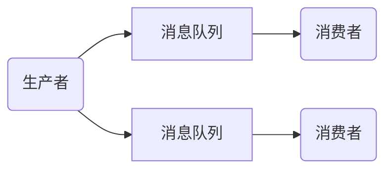
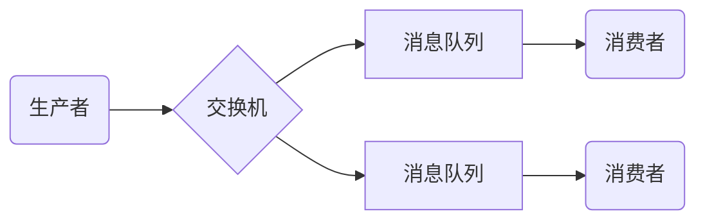
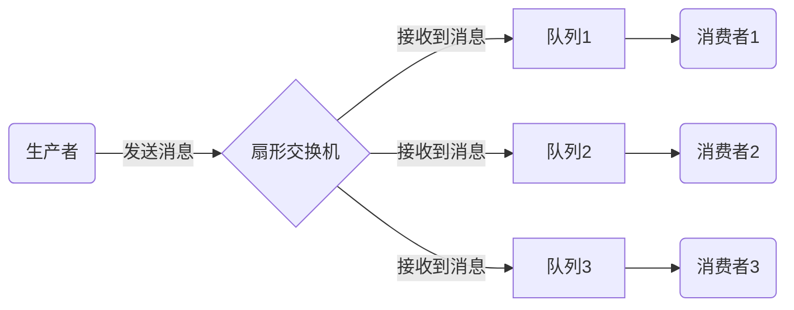
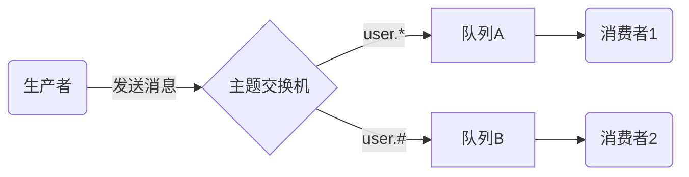

# RabbitMQ 学习笔记

想要学习 RabbitMQ 首先要知道 MQ 是什么东西，MQ(消息队列) 可以在应用之间传递消息，主要用途为高并发时的削峰 ( 减少服务器压力 )，例如我们的 Controller 接收到请求不在调用 Service，而是将相关信息发送到消息队列中，那么监听这个队列的 Service 就可以接收到这条信息并处理，如果有多个 Service 监听了这个消息队列就可以达到削峰的效果

市面上有很多的消息队列框架：RocketMQ、ActiveMQ、RabbitMQ、Kafka.... 这里学习的是 `RabbitMQ`

本次是基于 ( Windows 7 ) 学习的 RabbitMQ 3.8.9，后面会简称为 RabbitMQ 为 rabbit


## RabbitMQ 的安装

rabbit 是基于 erlang 语言进行开发的，所以无论什么平台在安装 rabbit 之前必须先配置 erlang 的环境

### Windows 平台

下载好必要的软件安装包：`otp_win64_23.1.exe` 和 `rabbitmq-server-3.8.9.exe`

> 配置 erlang

安装过程十分简单，双击 opt 开头的文件下一步傻瓜式安装即可，安装时注意留意安装位置，然后在系统环境变量中添加 `ERLANG_HOME` 然后在 path 中配置 bin 目录，和 JDK 的环境基本是一样的

>安装 RabbitMQ

同样双击 rabbit 开头的文件进行傻瓜式安装，安装完成后会在自动系统中创建一个 `RabbitMQ` 的服务，服务的开启和关闭就代表着 rabbit 的开启和关闭：


通过 windows 操作服务的命令 `net start ..` `net stop ..` 就可以控制 rabbit 的启动与关闭，这里我就把服务禁用了，测试环境下我选择通过控制台启动 rabbit

在 rabbit 服务关闭的情况下，通过双击 rabbit 安装目录下的 sbin 目录下的 `rabbitmq-server.bat` 文件，当看到控制台上的小兔子就代表 rabbit 启动成功了


通过 bat 文件启动 rabbit，cmd 窗口就代表 rabbit 服务，关闭窗口也就是关闭 rabbit，同 tomcat 一样


### CentOS 平台

研究的不透彻，等研究透彻再来记笔记，参考链接：[【保姆级】CentOS7安装RabbitMQ](https://www.cnblogs.com/fengyumeng/p/11133924.html)


> rabbit 常用操作命令

```shell
# 运行RabbitMQ
rabbitmq-server
# 后台运行RabbitMQ
rabbitmq-server -detached
# 停止运行
rabbitmqctl stop
# 查看RabbitMQ运行状态
rabbitmqctl status
# 帮助
rabbitmqctl help
```


## RabbitMQ 基本配置使用

我们查看 rabbit 安装目录下的 sbin 目录，可以看到目录下有一个 `rabbitmqctl.bat` 文件，我们想要通过命令操作 rabbit 必须要通过这个文件才可以，为了方便操作我们可以为 rabbit 配置一个环境变量：

1. 配置 `RABBIT_HOME` 系统变量到 rabbit 的安装目录下
2. 在 `path` 下追加到 `sbin` 目录


### 命令简单介绍

我们可以通过调用 `help` 来查看一下命令的基本使用方法，就比如这一段：

```cmd
C:\Users\Administrator>rabbitmqctl help

# 截取了一小块的内容，并非全部
Users: # Users表示操作用户相关命令

   add_user                      Creates a new user in the internal database
   authenticate_user             Attempts to authenticate a user. Exits with ......
   change_password               Changes the user password
   clear_password                Clears (resets) password and disables password .....
   delete_user                   Removes a user from the internal database ......
   list_users                    List user names and tags
   set_user_tags                 Sets user tags

Virtual hosts: # Virtual代表操作虚拟主机相关命令

   add_vhost                     Creates a virtual host
   clear_vhost_limits            Clears virtual host limits
   delete_vhost                  Deletes a virtual host
   list_vhost_limits             Displays configured virtual host limits
   restart_vhost                 Restarts a failed vhost data stores and queues
   set_vhost_limits              Sets virtual host limits
   trace_off
   trace_on
   
Access Control:

   clear_permissions             Revokes user permissions for a vhost
   clear_topic_permissions       Clears user topic permissions for a vhost ......
   list_permissions              Lists user permissions in a virtual host
   list_topic_permissions        Lists topic permissions in a virtual host
   list_user_permissions         Lists permissions of a user across all virtual hosts
   list_user_topic_permissions   Lists user topic permissions
   list_vhosts                   Lists virtual hosts
   set_permissions               Sets user permissions for a vhost
   set_topic_permissions         Sets user topic permissions for an exchange
```

可以看到大多数的命令，例如 `add_user 添加用户`，`list_user 查询所有用户`，`add_vhost 添加虚拟主机`，不用急着了解他们都是干什么的，先来照着敲一遍：

```cmd
# 查看所有用户(只有guest用户，默认密码也是guest，身份为administrator)
C:\Users\Administrator>rabbitmqctl list_users
Listing users ...
user    tags
guest   [administrator]
# 添加用户zhang、密码为hanzhe
C:\Users\Administrator>rabbitmqctl add_user zhang hanzhe
Adding user "zhang" ...
# 为用户zhang分配administrator权限
C:\Users\Administrator>rabbitmqctl set_user_tags zhang administrator
Setting tags for user "zhang" to [administrator] ...
# 创建虚拟主机/push
C:\Users\Administrator>rabbitmqctl add_vhost /push
Adding vhost "/push" ...
# 用户绑定虚拟主机并设置权限
C:\Users\Administrator>rabbitmqctl set_permissions -p /push zhang '.' '.' '.'
Setting permissions for user "zhang" in vhost "/push" ...
```

这样我们就通过命令简单的创建了一个账号 `zhang`密码 `hanzhe` 的用户，并绑定了 `/push` 虚拟主机


### 管理页面&管理插件

> 插件命令简单了解

命令不需要深入学习，了解到 help 随时查就可以了，大多数都是可以通过WEB页面进行操作的，接下来我们就来开启 rabbit 的 web 管理界面：

WEB 管理页面是 rabbit 中的一个插件 ( plugins )，需要调用命令来开启他，我们在来看下 sbin 目录，可以看到目录下有一个 `rabbitmq-plugins.bat` 文件，我们操作插件的命令都是靠他来完成的


同样调用一下他的 help 命令查看一下：

```cmd
Help:

   autocomplete  Provides command name autocomplete variants
   help          Displays usage information for a command
   version       Displays CLI tools version

Monitoring, observability and health checks:

   directories   Displays plugin directory and enabled plugin file paths
   is_enabled    Health check that exits with a non-zero code if provided ......

Plugin Management:

   disable       Disables one or more plugins
   enable        Enables one or more plugins
   list          Lists plugins and their state
   set           Enables one or more plugins, disables the rest
```

可以看到 `list` 是查看所有插件及状态，`enable` 和 `disable` 来控制插件的启用与关闭

> 开启管理页面插件

这里我们启用页面管理插件 `rabbitmq_management`：

```cmd
C:\Users\Administrator>rabbitmq-plugins enable rabbitmq_management
Enabling plugins on node rabbit@WIN-DK6C2IC0EG9:
rabbitmq_management
The following plugins have been configured:
    rabbitmq_management
    rabbitmq_management_agent
    rabbitmq_web_dispatch
Applying plugin configuration to rabbit@WIN-DK6C2IC0EG9...
Plugin configuration unchanged.
```

这样我们就成功开启了他的 WEB 管理功能，访问 `http://localhost:15672/` 就可以访问到我们的管理页面了


我们之前使用命令的时知道了 rabbit 有默认提供的 guest 用户，也有我们自己新建的 zhang 用户，任意选择一个登录即可，需要注意的是 **guest 只能本地登录**，而我们自己创建的用户支持远程登录，如果是在远程 linux 中搭建的 rabbit 服务记得用命令行创建一个用户出来

登录成功后可以看到管理页面，分为几大模块：


通过用户模块可以看到之前创建的用户以及设置的权限和绑定的虚拟主机：


> 其他插件介绍

- rabbitmq_web_stomp rabbitmq_stomp rabbitmq_web_stomp_examples
  - 这三个插件是一起使用的，用于前端使用 websocket 连接 rabbit 服务
- rabbitmq_mqtt rabbitmq_web_mqtt
  - 这两个插件是一起使用的，同上面一样便于前端操作，不过使用的是 mqtt 协议而已


## RabbitMQ 初体验

> 添加 Maven 依赖

这里我们先创建简单 maven 工程，使用 rabbit 需要添加对应的 maven 依赖

```xml
<dependency>
    <groupId>com.rabbitmq</groupId>
    <artifactId>amqp-client</artifactId>
    <version>5.10.0</version>
</dependency>
```

> 创建生产者类

按照之前的说法，将相关信息发送到消息队列中由其他服务进行处理，就相当于生产者消费者的关系，这里就简单创建两个类作为生产者和消费者，生产者用于向队列中发送消息，消费者监听队列取出消息

```java
// 生产者，用于将消息发送到消息队列中
public class Provider1 {
    public static void main(String[] args) throws Exception {
        // 首先获取连接工厂
        ConnectionFactory factory = new ConnectionFactory();
        // 设置工厂的连接信息
        factory.setUsername("zhang");     // 用户名
        factory.setPassword("hanzhe");    // 密码
        factory.setHost("192.168.1.147"); // 服务地址
        factory.setPort(5672);            // 端口号
        factory.setVirtualHost("/push");  // 设置虚拟主机
        // 从工厂中创建连接
        Connection conn = factory.newConnection();
        // 生产者向队列中写入消息是需要依靠通道的，这里通过链接对象创建通道
        Channel channel = conn.createChannel();
        // 我们的消息是要写入到队列中的，Rabbit中目前没有队列，所以我们需要声明出一个队列
        String queueName = "queue-1"; // 队列名称
        boolean durable = false;      // 是否持久化
        boolean exclusive = false;    // 是否排斥其他链接
        boolean autoDelete = true;    // 是否自动删除
        // 声明队列
        channel.queueDeclare(queueName, durable, exclusive, autoDelete, null);
        // 发送消息
        String message = "这是一条消息";
        channel.basicPublish("", queueName, null, message.getBytes());
    }
}
```

参数这里做一下详细的解释：

- 声明队列 `queueDeclare` 时的相关配置
  - `queueName：` 第一个参数，队列的名称，在队列声明后可以在管理页面的 `Queues` 面板中看到该队列
  - `durable：` 第二个参数，队列持久化，开启持久化后可以保持重启 rabbitm 后队列不会消失，这里需要注意一点，*队列持久化不代表消息就可以持久化，如果想要队列中的消息也持久化需要额外配置参数*
  - `exclusive：` 第三个参数，排斥设置，上述代码可以看出 `queue-1` 队列是由 `conn` 连接声明出来的，如果该值设置为 true 那么其他连接就都访问不了该通道
  - `autoDelete：` 第四个参数，自动删除配置，当该队列的消息被消费完毕且没有任何消费者连接该队列时，队列会自动删除
  - 第五个参数，是个 `map` 集合，用于对当前队列添加一个额外的配置 ( 例如生存时间 )
- 发送消息 `basicPublish` 时的相关配置：
  - 第一个参数为交换机，这里用不到交换机，暂时设置为空字符串，注意**不能为 null**，否则会报错
  - 第二个参数为路由参数，这里指定发送的目标队列名称即可
  - 第三个参数为消息设置，例如上面提到的消息持久化就是在这里配置的
  - 第四个参数为发送的具体消息，因为需要的是字节数组，所以这里用了 `getBytes` 方法

这样一来生产者就配置完成了，我们来运行一下看看效果


仔细看一下控制台，程序还没有结束运行，在 `Connections` 和 `Channels` 面板中也可以看到还有连接存在，所以在代码结束后需要关流

```java
public class Provider1 {
    public static void main(String[] args) throws Exception {
        ......
        channel.close();
		conn.close();
    }
}
```


> 创建消费者类

生产者已经完成了，向 queue-1 中插入了消息，接下来创建消费者来接收消息

```java
public class Consumer1 {
    public static void main(String[] args) throws Exception {
        // 一模一样的配置
        ConnectionFactory factory = new ConnectionFactory();
        factory.setUsername("zhang");     // 用户名
        factory.setPassword("hanzhe");    // 密码
        factory.setHost("192.168.1.147"); // 服务地址
        factory.setPort(5672);            // 端口号
        factory.setVirtualHost("/push");  // 设置虚拟主机
        Connection conn = factory.newConnection();
        Channel channel = conn.createChannel();
        // 因为队列已经存在了，所以这里就不进行声明了，直接订阅监听即可
        String queueName = "queue-1";
        boolean autoAck = true;
        // 消费者订阅队列进行监听
        channel.basicConsume(queueName, autoAck, new DefaultConsumer(channel){
            @Override
            public void handleDelivery(
                    String consumerTag,
                    Envelope envelope,
                    AMQP.BasicProperties properties,
                    byte[] body) throws IOException {
                System.out.println("接收到了消息： " + new String(body));
            }
        });
        // 关流
        channel.close();
        conn.close();
    }
}
```

参数这里做一下详细的解释：

- 消费者的 `basicConsume` 相关配置
  - `queueName：` 监听的目标队列名称
  - `autoAck：` 是否自动确认，这里使用 true 就可以了
  - `DefaultConsumer：` 可以理解为回调方法，需要创建 `DefaultConsumer` 实例复写 `handleDelivery` 方法，该方法最后一个参数 ( 字节数组 ) 就是接收到的消息内容

运行结果为：


> 抽取工具类 ( 后续操作都会用到该类 )

通过上面的代码可以发现，无论生产者还是消费者，想要生产或消费消息都要获取到通道连接，所以我们可以抽出一个工具类，封装一些常用的方法

```java
public class RabbitMQ {

    private static final String URL = "192.168.1.108";
    private static final int PORT = 5672;
    private static final String VIRTUAL = "/push";
    private static final String USERNAME = "zhang";
    private static final String PASSWORD = "hanzhe";

    // 获取连接
    public static Connection getConnection(){
        ConnectionFactory factory = new ConnectionFactory();
        factory.setHost(URL);
        factory.setPort(PORT);
        factory.setVirtualHost(VIRTUAL);
        factory.setUsername(USERNAME);
        factory.setPassword(PASSWORD);
        Connection conn = null;
        try {
            conn = factory.newConnection();
        } catch (Exception e) {
            e.printStackTrace();
        }
        return conn;
    }

    // 通过链接获取到通道
    public static Channel getChannel(Connection conn){
        Channel channel = null;
        try {
            channel = conn.createChannel();
        } catch (IOException e) {
            e.printStackTrace();
        }
        return channel;
    }

    // 关流
    public static void close(Channel channel) {
        // 这里可以通过通道获取到当前连接
        Connection conn = channel.getConnection();
        try {
            channel.close();
            conn.close();
        } catch (Exception e) {
            System.err.println("关流失败！");
            e.printStackTrace();
        }
    }

}
```


## 交换机的使用

> 消息队列流程简介

按照刚刚的操作可以得到，我们正常操作消息队列应该是由生产者生产消息，发送到消息队列，然后由消费者来订阅消息队列，来接收生产者发出的消息从而执行业务逻辑，流程大概是这样：



但是实际情况下生产者并不是直接将消息发送到消息队列的，而是中间经过一层 **交换机 ( exchange )**，生产者将消息发送到交换机，然后由交换机决定以什么方式发送，将消息分发到哪些队列



一个交换机可以连接多个消息队列，以什么方式发送消息取决于使用类型的交换机，rabbit 中有很多种类型的交换机，这里记录三种最常用的交换机类型：  **扇形**、**直连**、**主题**


### 扇形交换机

> 扇形交换机简单了解

扇形交换机 ( **fanout** ) 的特点是 *可以将消息分发给每个队列*，所以他又被成为广播，流程图如下所示：



> 创建消费者模型类

我们在消费的时候需要创建 `DefaultConsumer` 类的实例，还要复写其中的方法，如果消费者比较多的话就会造成代码冗余，这里创建一个通用的消费者模型，用于后续的测试：

```java
// 继承了DefaultConsumer类的
public class Consumer extends DefaultConsumer {

    private String consumerName;

    // 第一个参数为消费者名称，第二个参数为通道
    public Consumer(String consumerName, Channel channel) {
        super(channel);
        this.consumerName = consumerName;
    }

    @Override
    public void handleDelivery(String consumerTag,
            Envelope envelope,
            AMQP.BasicProperties properties,
            byte[] body) throws IOException {
        System.out.println(this.consumerName + "： " + new String(body));
    }

}
```


> 创建消费者类

接下来我们来创建三个消费者来监听这个队列：

```java
// 消费者类
public class Consumer2 {

    public static void main(String[] args) throws IOException {
        Channel channel = RabbitMQ.getChannel(RabbitMQ.getConnection());
        // 这里声明三条队列，分别用三个消费者监听这个队列
        String queueName = "queue-";
        for (int i = 1; i <= 3; i++) {
            String name = queueName + i;
            channel.queueDeclare(name, false, false, false, null);
            channel.basicConsume(name, true, new Consumer("消费者" + i, channel));
        }
        // 需要注意的是这里并没有关流，因为这里要实现长连接的监听效果
    }

}
```


> 创建生产者类

在之前初体验中的交换机使用的是空字符串，这次就要使用我们声明出来的交换机了：

```java
// 生产者，用于将消息发送到消息队列中
public class Provider2 {
    public static void main(String[] args) throws Exception {
        Connection conn = RabbitMQ.getConnection();
        Channel channel = RabbitMQ.getChannel(conn);
        // 声明交换机   第一个参数：交换机名称，  第二个参数：交换机类型
        String exchangeName = "exchange-1-fanout";
        String type = "fanout";
        channel.exchangeDeclare(exchangeName, type);
        // 将三个队列绑定到交换机中，最后一个参数是路由参数，没用的东西不用管
        channel.queueBind("queue-1", exchangeName, "");
        channel.queueBind("queue-2", exchangeName, "");
        channel.queueBind("queue-3", exchangeName, "");
        // 因为这里是将消息发送到交换机中，所以第二个参数就不用写了，把第一个交换机填上就行
        channel.basicPublish(exchangeName, "", null, "123".getBytes());
        RabbitMQ.close(channel);
    }
}
```

参数这里做一下详细的解释：

- `queueBind` 绑定函数：第一个为队列名称，第二个为交换机名称，第三个为路由参数，他的作用是将队列添加到交换机的绑定当中，例如 `queueBind("queue-1", exchangeName, "")` 这段代码表示是将 `queue-1` 队列绑定到 `exchangeName` 交换机中
- 路由参数在扇形交换机中不起作用，所以给个空字符串就够了，注意给 null 的话会报错


> 测试效果：

这里生产者消费者已经都创建完成了，接下来就测试一下运行效果 ( 先运行消费者，声明队列并监听，然后在运行生产者 ) ，可以看到发送一条消息，三个消费者同时接收到了信息，证明了 **扇形交换机的广播性质**


### 直连交换机

直连交换机 ( **direct** ) 的特点是 **接收到消息后会通过 *轮询* 的方式分发给消息队列**，而想要实现这种效果，需要依靠路由参数 `routingKey` 才可以实现

在上面的 `Fanout` 交换机进行绑定操作的时候，最后一个参数就是路由参数，我们可以在队列绑定到交换机的时候可以约定一个参数，然后在生产者发送消息的时候在携带这个参数，这样依赖就可以保证只有符合条件的消费者才能接收到消息

~~~mermaid
graph LR
A(生产者) -->|key:k2|B{直连交换机} 
			B -->|key:k1|C[队列A] -->D(消费者1)
			B -->|key:k2|E[队列B] -->|符合条件接收到消息|F(消费者2)
            B -->|key:k3|G[队列C] -->H(消费者3)
~~~

> 消费者代码

```java
public class Consumer3 {
    public static void main(String[] args) throws IOException {
        // 消费者没有改动只不过队列在创建的时候取消了自动删除，所以这里就不用在创建一次了
        Channel channel = RabbitMQ.getChannel(RabbitMQ.getConnection());
        for (int i = 1; i <= 3; i++) {
            String queueName = "queue-" + i;
            channel.basicConsume(queueName, true, new Consumer("消费者" + i, channel));
        }
    }
}
```


> 生产者代码

```java
public class Provider3 {
    public static void main(String[] args) throws Exception {
        Channel channel = RabbitMQ.getChannel(RabbitMQ.getConnection());
        // 这里设置声明的交换机类型为直连
        String exchangeName = "exchange-2-direct";
        String type = "direct";
        channel.exchangeDeclare(exchangeName, type);
        // 在队列绑定到交换机的时候，需要约定一个路由参数routingKey
        channel.queueBind("queue-1", exchangeName, "k1");
        channel.queueBind("queue-2", exchangeName, "k2");
        channel.queueBind("queue-3", exchangeName, "k3");
        // 在向交换机发送消息的时候携带路由参数，明确告诉交换机这条消息应该由哪些队列接收
        channel.basicPublish(exchangeName, "k1", null, "哈哈".getBytes());
        channel.basicPublish(exchangeName, "k2", null, "嘿嘿".getBytes());
        channel.basicPublish(exchangeName, "k3", null, "嘻嘻".getBytes());
        RabbitMQ.close(channel);
    }
}
```


> 运行结果：

因为约定了路由参数，所以只有符合条件的队列才能接收到对应的消息，运行结果为：


直连交换机需要通过 `routingKey` 进行约束，只有符合条件的队列才能接受到消息，如果有多个消息队列设置了同样的 `routingKey`，那么每个队列都能接收到消息，这就说明了一个问题，如果我们把所有 `routingKey` 都设置为一样的值，那么直连是可以当成广播使用的。


### 主题交换机

主题交换机 ( **topic** )，是这三种交换机中最强大的交换机，他的使用方法和直连一样，通过 `RoutingKey` 来指定消息发送给指定的队列，但是主题交换机的强大之处就在于 `RoutingKey` 支持通配符

**通配符有两种表现形式：**

- routingkey 中小数点 `.` 代表着单词之间的分隔符
- `*`：星号通配符可以匹配单个单词
- `#`：井号通配符可以匹配任意数量 ( 0 ~ 无穷大 ) 的单词



参数太多图画不下，这里就手动描述一下，当发送的消息 `RoutingKey` 为各种值时的反应：

- `routingkey = user.insert`：两种消息队列都匹配，都可以接受的到
- `routingkey = user.insert.ok`：队列 B 接收的到，A 的星号只支持单个单词的通配符，所以接收不到
- `routingkey = user`：A 的星号只支持单个单词的通配符，所以接收不到，消息队列 B 接收的到 ( 0 ~ ∞ )

> 生产者代码：

消费者监听改为前两个队列，其他代码不变，这里只修改生产者的绑定以及 `routingKey` 即可：

```java
// 生产者
public class Provider4 {
    public static void main(String[] args) throws Exception {
        Channel channel = RabbitMQ.getChannel(RabbitMQ.getConnection());
        // 这里设置声明的交换机类型为直连
        String exchangeName = "exchange-3-topic";
        String type = "topic";
        channel.exchangeDeclare(exchangeName, type);
        // 将三个队列绑定到交换机中，最后一个是路由参数，没用的东西不用管
        channel.queueBind("queue-1", exchangeName, "user.*");
        channel.queueBind("queue-2", exchangeName, "user.#");
        // 因为这里是将消息发送到交换机中，所以第二个参数就不用写了，把第一个交换机填上就行
        channel.basicPublish(exchangeName, "user.insert", null, "哈哈".getBytes());
        channel.basicPublish(exchangeName, "user.insert.ok", null, "嘿嘿".getBytes());
        channel.basicPublish(exchangeName, "user", null, "嘻嘻".getBytes());
        RabbitMQ.close(channel);
    }
}
```


> 运行结果

这里可以看到和我们之前推算的一样，消费者1只接收到了一条消息，消费者2接收到了所有消息


为什么说主题交换机最强大？因为在 `RoutingKey` 不使用通配符的情况下，他就是直连交换机，当使用通配符，但是只使用单个井号的话，那他就是扇形交换机，他可以充当三个交换机来使用！


### 默认交换机的负载均衡

在初体验的时候我们尝试了不使用交换机进行交互，然而实际上在不指定交换机的情况下其实是通过了默认交换机进行操作的，**rabbit 的默认交换机是直连交换机**，这一点可以从管理页面的 `Exchanges` 面板中观察到


在默认交换机使用 `basicPublish` 函数的时使用队列名称作为路由参数，从而找到消息发送的目标

如果两个消费者监听同一个队列，会按照轮询的方式进行消费，队列会依次将消息分发给下面的消费者，消费者 A 的性能较高很快就可以完成，但消费者 B 会卡很久，这时就需要使用负载均衡方案了

> 将默认交换机 ( 直连 ) 轮询改为负载均衡

```java
// 消费者代码
public class ConsumerExample {
    public static void main(String[] args) throws IOException {
        Channel channel = RabbitMQ.getChannel(RabbitMQ.getConnection());
        // 这里设置当前通道每次只处理一个消息，只有处理完当前消息才能拿到下一条，实现负载均衡
        channel.basicQos(1);
        channel.basicConsume("queue-1", true, new Consumer("消费者1", channel));
        channel.basicConsume("queue-1", true, new Consumer("消费者2", channel));
    }
}
```


## 其他操作

### 消息手动确认

我们的消费者在接收到消息的时候会反馈给 rabbit 一个确认收到的信息，当 rabbit 确保你收到消息后才能分发下一条消息，但是这样有一个漏洞，如果我接收到消息并反馈，但是在业务逻辑执行一半的时候突然因为不可抗力的因素 ( 停电、断网等 .... ) 导致该消息并没有达到目标效果，但是 rabbit 却认为这条消息已经执行了，这就导致了一个问题：**消息丢失**，对于这个问题可以关闭自动确认，改为手动确认解决

首先向队列中添加一条消息 ( 代码就不粘了 ) ：


```java
// 消费者代码
public class ConsumerExample {
    public static void main(String[] args) throws IOException {
        Channel channel = RabbitMQ.getChannel(RabbitMQ.getConnection());
        // 注意这里自动确认为false
        boolean autoAck = false;
        channel.basicConsume("queue-1", autoAck, new Consumer("消费者", channel));
    }
}
```

然后运行消费者，可以看到消息已经消费到了，但是我们在回到管理页面上看看：


队列消息总数没有变化，但是状态变成了 `Unacked` 代表着消息已读但未确认，具有该状态的消息在重启消费者后会重新消费，如果重新消费后还没有确认的话，那么再次重启还会重新消费，直到确认为止，消息才会被移除队列，这样我们就可以等待业务逻辑处理完成后在进行确认，就可以有效防止消息丢失的问题：

```java
// 消费者代码
public class Consumer5 extends DefaultConsumer {

    public Consumer5(Channel channel) {
        super(channel);
    }

    public static void main(String[] args) throws IOException {
        Channel channel = RabbitMQ.getChannel(RabbitMQ.getConnection());
        channel.basicConsume("queue-1", false, new Consumer5(channel));
    }

    @Override
    public void handleDelivery(
            String consumerTag,
            Envelope envelope,
            AMQP.BasicProperties properties,
            byte[] body) throws IOException {
        // 在这里处理业务逻辑
        // service.xxx
        // 手动确认该消息
        super.getChannel().basicAck(envelope.getDeliveryTag(), false);
    }
}
```


### 获取队列信息

我们在有些情况下需要获取到队列的一些相关信息来达到某些操作，这些在代码中可以这样实现：

> 声明队列时的返回值

```java
public class Demo1 {
    public static void main(String[] args) throws Exception{
        Channel channel = RabbitMQ.getChannel(RabbitMQ.getConnection());
        // 在声明队列的时候会返回一个DeclareOk的内部类对象，可以用它获取到相关信息
        AMQP.Queue.DeclareOk declare =
                channel.queueDeclare("z-queue", false, false, true, null);
        // 获取队列名称
        String queueName = declare.getQueue();
        // 队列下消费者数量
        int consumerCount = declare.getConsumerCount();
        // 队列下消息数量
        int messageCount = declare.getMessageCount();
    }
}
```

> 获取指定队列的相关信息

```java
public class GetQueueInfo {
    public static void main(String[] args) throws Exception{
        Channel channel = RabbitMQ.getChannel(RabbitMQ.getConnection());
        // 通过队列名称获取达到DeclareOk实例
        AMQP.Queue.DeclareOk declare = channel.queueDeclarePassive("z-queue");
        System.out.println(declare.getQueue());
        System.out.println(declare.getConsumerCount());
        System.out.println(declare.getMessageCount());
        RabbitMQ.close(channel);
    }
}
```


### 设置超时时间

> 队列级别超时时间

**1. **在声明队列的时候最后一个参数一直为 null，这里可以通过使用这个参数来设置 **队列级别** 的消息超时时间

```java
public class QueueTimeout {
    public static void main(String[] args) throws Exception{
        Channel channel = RabbitMQ.getChannel(RabbitMQ.getConnection());
        Map<String, Object> settings = new HashMap<>();
        // 设置消息超时时间ms，队列级别参数针对当前队列内的所有消息生效
        settings.put("x-message-ttl", 10 * 1000);
        channel.queueDeclare("queue-timeout-1", false, false, true, settings);
        channel.basicPublish("", "queue-timeout-1", null, "123".getBytes());
        RabbitMQ.close(channel);
    }
}
```


**2. **除开设置队列级别的消息超时时间之外，还可以设置队列本身的超时时长：

```java
public class QueueTimeout2 {
    public static void main(String[] args) throws Exception{
        Channel channel = RabbitMQ.getChannel(RabbitMQ.getConnection());
        Map<String, Object> settings = new HashMap<>();
        // 设置当前队列的超时时长ms，时间过后队列会自动删除
        settings.put("x-expires", 10 * 1000);
        channel.queueDeclare("queue-timeout-1", false, false, true, settings);
        RabbitMQ.close(channel);
    }
}
```


> 消息级别的超时时间

除开上面两种方法之外，我们在发送消息的时候也可以针对消息设置超时时间

```java
public class QueueTimeout3 {

    public static void main(String[] args) throws Exception{
        Channel channel = RabbitMQ.getChannel(RabbitMQ.getConnection());
        String queueName = "queue-timeout-3";
        channel.queueDeclare(queueName, false, false, true, null);
        channel.basicPublish("", queueName, getProp(10), "123".getBytes());
        channel.basicPublish("", queueName, getProp(60), "456".getBytes());
        RabbitMQ.close(channel);
    }

    // 获取配置实例
    public static AMQP.BasicProperties getProp(int second){
        return new AMQP.BasicProperties.Builder()
            	// 设置消息超时时间ms
                .expiration(Long.toString((second * 1000)))
                .build();
    }

}
```


这里已经可以看到结果了，我们可以点击队列名称进入队列详情页，通过 `Get Message(s)` 查看队列消息信息：


## 前端连接 RabbitMQ

```html
<!DOCTYPE html>
<html lang="ch">

<head>
    <meta charset="UTF-8">
    <title>RabbitMQ</title>
    <!-- 引入相关的JS文件 -->
    <script src="https://cdn.bootcss.com/stomp.js/2.3.3/stomp.js"></script>
    <script src="https://cdn.bootcss.com/sockjs-client/1.1.4/sockjs.js"></script>
</head>

<body></body>

<script type="text/javascript">
    // 初始化ws对象
    let url = "192.168.1.108";
    let ws = new WebSocket(`ws://${url}:15672/ws`);

    // 获得Stomp client对象
    let client = Stomp.over(ws);

    // 连接RabbitMQ
    let username = "zhang";
    let password = "hanzhe";
    let virtual = "/push";
    client.connect(username, password, success, error, virtual);

    // 定义连接成功回调函数
    function success(x) {
        let queue = "queue-1"
        // console.log("x", x);
        client.subscribe(`/queue/${queue}`, function (res) {
            console.log(`接收到的消息为： ${res.body}`);
        });
    };

    // 定义错误时回调函数
    function error(e) {
        console.log("error", e);
    };

</script>

</html>
```

**需要注意的是**：协议为 `ws` 协议，需要先获取到 socket 对象，然后在交给 `Stomp` 返回客户端对象在进行操作