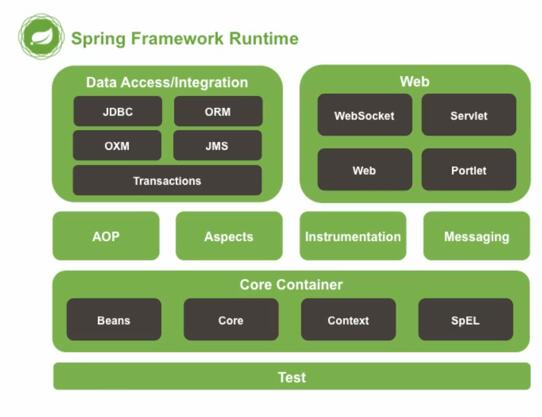
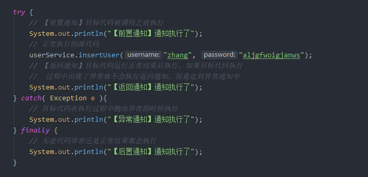

# Spring 笔记

spring 是基于 java 语言的轻量级的 IOC 和 AOP 容器框架，使用 spring 可以简易开发流程，降低代码耦合度

> 它主要包括以下几个模块

| 模块    | 作用                                                         |
| ------- | ------------------------------------------------------------ |
| core    | 核心类库，提供 spring 的 ioc 容器服务，是 spring 框架运行的基础 |
| context | 提供了 bean 的获取功能和解析配置文件的服务                   |
| aop     | 提供了 aop 面向切面编程的服务                                |
| dao     | 提供了简单的 JDBC 功能                                       |
| orm     | 对 ORM 框架提供了很好的整合服务                              |
| web     | 提供 web 方面的服务                                          |



## 简单Spring程序实例

### spring 环境搭建

使用 Spring 需要导入他的 maven 依赖：

~~~xml
<!-- 想要使用Spring框架需要添加一个context依赖，他会加载spring有关的多个jar包 -->
<dependency>
    <groupId>org.springframework</groupId>
    <artifactId>spring-context</artifactId>
    <version>5.1.5.RELEASE</version>
</dependency>
~~~

### 配置文件的编写

在 IDEA 环境下，在项目 resources 目录下新建 spring config 配置文件，然后创建一个简单的实体类，在配置文件使用 `bean` 标签装配这个 bean (实体类)

~~~xml
<bean class="site.hanzhe.bean.Dog" id="dog01"></bean>
~~~

然后在测试类中获取到这个 Bean 即可

~~~java
@Test
public void test1(){
    ApplicationContext ioc = new ClassPathXmlApplicationContext("spring.xml");
    Dog dog01 = (Dog)ioc.getBean("dog01");
    System.out.println(dog01);
}
~~~


## Spring IOC 容器

IOC（Inver se of Control）可理解为容器，是 Spring 框架的和核心，他管理着 Spring 的组件，实现了控制反转的功能，之前练习配置的 dog 就是放在了 IOC 容器中才可以获取得到

### Bean 工厂

Bean 工厂可以理解为 IOC 容器 ，由它来为我们创建 Bean 的实例对象，通过 Bean 工厂的实例可以获取到装配在 IOC 中的 Bean 的实例

1、BeanFactory 接口：Spring最核心的接口，提供了 IOC 配置机制，通常被称为 IOC 容器

2、ApplicationContext 接口：应用上下文，建立在 Bean 工厂的基础上，他下面有两个实现类:

1. ClassPathXmlApplication： 从类路径 ( classpath ) 下加载配置文件
2. FileSystemXmlApplicationContext：  从文件系统 ( url路径 ) 中加载配置文件


**BeanFactory 和 ApplicationContext的区别**

1. BeanFactory 会在本身实例化完成后，在调用某个 getBean 的时候才会实例化那个对应的 bean，而ApplicationContext 是在加载配置文件的时候就将所有单例模式的 bean 实例化
2. ApplicationContext 在启动时就会检查 XML 文件是否正确，而 BeanFactory 则是在获取 Bean 时才会检查


### XML 配置 Bean

#### Bean 的装配与获取

装配 Bean 需要使用 `bean` 标签进行装配，class 属性来指定被装配的类，id 作为类的名字不可重复

~~~xml
<!--通过类的全限定名（包名+类名）告知SpringIOC容器要管理和创建bean对象-->
<bean class="site.hanzhe.bean.Dog" id="dog01"></bean>
~~~

配置好XML后再类中获取bean对象：

~~~java
@Test
public void test1(){
    // 通过目标配置文件创建IOC容器实例
    ApplicationContext ioc = new ClassPathXmlApplicationContext("spring.xml");
    // 通过IOC实例获取其中已装配的bean(默认获取到的是Object类型的对象，需要进行向下转型)
    Dog dog01 = (Dog)ioc.getBean("dog01");
    // 打印测试
    System.out.println(dog01);
}
~~~

使用 xml 装配 bean 的时候，可以向 bean 中注入参数，注入参数的过程就叫 ==DI ( 依赖注入 )==


#### 配置文件的依赖注入

我们将一开始的 dog 类中的值设置为 null，然后通过依赖注入的方法对实例进行赋值

正常的依赖注入是依靠属性内的 ==set 方法依赖注入==的，如果 set 方法不存在或命名错误则会影响正常运行

~~~xml
<bean class="site.hanzhe.bean.Dog" id="dog01">
    <property name="name" value="哈哈" />
    <property name="age" value="7" />
</bean>
~~~

除开 set 依赖注入还可以通过==构造方法依赖注入==，在实体类中创建构造器，然后在配置文件中：

~~~xml
<bean class="site.hanzhe.bean.Dog" id="dog01">
    <constructor-arg name="name" value="嘿嘿" />
    <constructor-arg name="age" value="4" />
</bean>
~~~

如果被注入的不是一般类型而是引用类型，例如一个人养了狗，person 类内有一个属性是 dog

> ==引用类型注入1==：使用 ref 属性来引用定义过的 bean ( 定义的Bean不分先后顺序 )

~~~xml
<bean class="site.hanzhe.bean.Dog" id="dog01">
    <constructor-arg name="name" value="嘿嘿" />
    <constructor-arg name="age" value="4" />
</bean>
<bean class="site.hanzhe.bean.Person" id="person1">
    <property name="name" value="李江" />
    <property name="dog" ref="dog01" />
</bean>
~~~

> 除开自定义的引用类型之外，java 有很多引用类型，例如集合数组

~~~xml
<bean class="site.hanzhe.pojo.Good" id="good">
    <property name="name"> <value>Good测试类</value> </property>
    <property name="list">
        <list> <value>list第一个元素</value>
            <value>list第二个元素</value> </list>
    </property>
    <property name="set">
        <set> <value>set第一个元素</value>
            <value>set第二个元素</value> </set>
    </property>
    <property name="map">
        <map>
            <entry key="key1">
                <value>value1</value>
            </entry>
            <entry key="key2" value="value2" />
        </map>
    </property>
    <property name="arr">
        <array>
            <value>10</value>
            <value>20</value>
        </array>
    </property>
    <property name="user" ref="user2"/>
</bean>
~~~

- 注入 list 集合需要在 `property` 标签下使用 `list` 下的 `value` 来进行注入
- 注入 set 集合同 list 一个原理，只不过将 list  转换为 set
- 注入 map 集合需要在 `property` 标签下：
  - 使用 `entry` 作为 key，而后用 `entry` 的子标签 `value` 作为 value
  - 也可以直接在 `entry` 标签上以属性的方式传入 key="" value=""
- 注入数组同 list 和 set，将中间标签换为 `array` 即可，用 `value` 子标签来传值


扩展：==名称空间注入==，在配置文件中添加 p 的命名空间，然后通过属性的方式进行注入

> p 命名空间后面跟上注入的属性名称，然后将值填入即可，需要留意的是 p 标签也是依赖 set 方法的

~~~xml
<bean class="site.hanzhe.bean.Dog" id="dog" p:value="123" />
~~~

> p 命名空间是针对属性的 set 方法的，那么自然也就有针对构造方法的 c 命名空间

~~~xml
<!-- 通过c命名空间操作构造方法内的指定参数名称进行注入 -->
<bean class="site.hanzhe.bean.Dog" id="dog" c:value="456" />
<!-- 也可以通过构造方法参数的下标顺序进行注入 -->
<bean class="site.hanzhe.bean.Dog" id="dog" c:_0="456" />
~~~


#### Bean 别名配置

在 xml 中装配了某个 bean 后，需要通过标签的 id 或者 name 值从 IOC 容器中获取到该类的实例，除 id，name 属性之外，还可以通过别名来获取指定的 bean，为装配的 bean 起别名需要使用到 `alias` 标签

> 将名为 dog 的 bean 起别名为 abc，这样出来 dog 可以获取到之外，使用 abc 也可以获取得到

~~~xml
<bean class="site.hanzhe.bean.Dog" id="dog">
    <constructor-arg name="name" value="嘿嘿" />
    <constructor-arg name="age" value="4" />
</bean>
<alias name="dog" alias="abc"></alias>
~~~


### 注解装配 Bean

#### 搭建 Junit 测试环境

因为注解操作 Bean 不会手动创建 IOC 容器，所以就要升级一下 Junit 测试，让他自行创建 IOC

~~~xml
<dependency>
    <groupId>junit</groupId>
    <artifactId>junit</artifactId>
    <version>4.12</version>
    <scope>test</scope>
</dependency>
<dependency>
    <groupId>org.springframework</groupId>
    <artifactId>spring-test</artifactId>
    <version>${spring-version}</version>
    <scope>test</scope>
</dependency>
~~~


#### Bean 的装配与获取

在实体类上使用 `@Component` 注解将他装配到 IOC 中

~~~java
@Component
public class Dog{
    String name = "阿汪";
    String gender = "雄性";
}
~~~

在配置文件中打开注解配置 Bean 的功能，并扫描注解存在的包

~~~xml
<context:annotation-config />
<context:component-scan base-package="site.hanzhe" />
~~~

测试注解获取 bean

>@ContextConfiguration 注解指定配置文件来生成 IOC 容器
>
>@RunWith 注解来指定使用 spring 集成的注解，可以使用 IOC
>
>@Autowired 注解用于自动装配 IOC 内符合条件的 Bean

```java
@ContextConfiguration("classpath:spring.xml")
@RunWith(SpringJUnit4ClassRunner.class)
public class TestForAnnotation {
    @Autowired private Dog d;
    @Test
    public void test1(){
        System.out.println(d.name);
    }
}
```


#### 注解装配的依赖注入

==简单类型依赖注入== ( 包括 String ) 只需要在该变量上标注 @Value，在注解时传入注入的值即可

```java
@Component
public class Dog {
    @Value("12")
    private String value;
}
```

==引用类型依赖注入==直接使用 @Autowired 注解进行注入即可


#### @Spring 的自动装配

AutoWired 注解，他的作用是自动检测 IOC 容器中符合被装配的条件的 Bean 然后将其装配进来，他默认查找符合的条件是 Bean 的类型

那么一个新的问题就诞生了，如果 IOC 中有两个类型一样的 Bean，这个时候就需要用到另一个注解 ==@Qualifier==

> 在向 IOC 中装配 Bean 的时候，给他一个名字

~~~java
@Component(value="dog01")
public class Dog{
    String name = "阿汪";
    String gender = "雄性";
}
~~~

> 在使用 @AutoWired 进行自动装配的时候配合 @Qualifier 使用，指定被装配的 bean 的名称

```java
@Autowired
@Qualifier("dog01")
Dog dog;
@Test
public void test1(){
    System.out.println(dog);
}
```

#### <font color="red">**分层注解--语义化**</font>

| 注解        | 语义化                                                       |
| ----------- | ------------------------------------------------------------ |
| @Component  | 注解表明当前类为 Bean , 同时当有其他无法归类的也可以使用当前注解 |
| @Controller | 适用于 web 层,  用来标识当前类是控制器类                     |
| @Service    | 适用于 service 层的注解,  用来书写逻辑处理                   |
| @Repository | 适用于 dao 层的类                                            |


### Java 类配置 Bean

在 Spring 中可以通过 Java 类来配置 bean，但是这种做法并不常用，了解即可

#### Bean 的装配与获取

创建一个配置类，用来专门装配 bean，使用 ==@Configuration== 注解标识该类，在配置类中使用函数来返回实例对象，在函数上添加 @Bean 注解即可完成装配，@Bean 还可以传入参数做为 bean 的名称

> 需要在配置文件中扫描配置类才可以被使用

```java
@Configuration
public class config {
    @Bean("dog01")
    public Dog getDog01(){
        return new Dog("dog01");
    }
}
```

装配完成后获取该类即可

```java
@Test
public void test1(){
    ApplicationContext ioc = new ClassPathXmlApplicationContext("SpringConfig.xml");
    Dog dog01 = (Dog)ioc.getBean("dog01");
    System.out.println(dog01);
}
```


### Bean的作用域

Bean 的作用域有常见的几种：单例，多例，request、session, global，bean 的作用域的配置方法是在 Spring 中配置 bean 的时候在 bean 标签上添加的 scope 属性

| 作用域        | 效果及作用                                                   |
| ------------- | ------------------------------------------------------------ |
| singleton     | 单例模式，默认作用域,单例模式下的所有组件都在ioc启动完毕之前完成注册,表示spring IOC中只能存在一个Bean实例 |
| prototype     | 原型模式，ioc容器启动时不会注册组件，什么时候获取bean，什么时候创建，每次获取bean时都是一个新的实例 |
| request       | 每次Http请求都会创建一个新的Bean，切这个Bean只在当前request内有效 |
| session       | 同一个Session中共享Bean实例，不同的Session请求会创建新的Bean实 |
| globalSession | 在一个全局Session中，容器会返回该Bean的同一个实例，仅适用于Portlet应用环境 |


### Bean的生命周期

Bean的生命周期是指Bean从创建到销毁的过程，在Spring中配置Bean之后，在加载Spring核心配置文件的时候初始化，调用 close 方法的时候销毁，可以在xml中配置Bean的时候,通过Bean标签中的属性控制让他在初始化和销毁的时候可以执行什么方法

当使用 XML 配置 Bean 的时候

~~~xml
<bean class="site.hanzhe.pojo.User" id="user" scope="singleton" init-method="init" destroy-method="destroy" />
~~~

在配置Bean的时候指定了init-method和destroy-method两个属性,  他们分别代表着:

1. init-method="init"   在初始化的时候执行当前 Bean 中名称为 init 的方法

2. destroy-method="destroy"   在销毁的时候执行当前 Bean 中名称为 destroy 的方法

>  注意: 初始化方法的执行优先级低于构造方法


### Spring 的懒加载

在 Spring 中的 ClassPathXmlApplicationContext 中，默认只要将 bean 装配进去，无论是否使用了他，都会对 Bean 进行实例化 ( 这一点通过构造函数可以体现 )，但是配置 Bean 的时候可以为他手动设置一个属性，让 IOC 不对它进行自动实例化，这个叫做 ==bean 的懒加载==，通过装配 bean 时的 lazy-init 属性来控制

> dog01 正常装配，在创建 IOC 容器的时候会自动实例化，而 dog02 则会在使用 getBean 后才会实例化

```xml
<bean id="dog01" class="site.hanzhe.bean.Dog">
    <constructor-arg name="value" value="dog01" />
</bean>
<bean id="dog02" class="site.hanzhe.bean.Dog" lazy-init="true">
    <constructor-arg name="value" value="dog02" />
</bean>
```

 

### 整合多个配置文件

我们在写程序的时候，可能会将配置信息分开为 n 多个配置文件，例如 spring 本身的配置文件，整合 mybatis 以及 mvc 等等，当我们书写了多个配置文件的时候我们就需要将他们整合起来：

~~~xml
<!--将指定的xml文件整合到当前文件中-->
<import resource="spring-mybatis.xml" />
~~~


## AOP 面向切面编程

在 Spring 中使用 AOP 需要引入 aspect 的依赖

~~~xml
<dependency>
    <groupId>org.springframework</groupId>
    <artifactId>spring-aspects</artifactId>
    <version>5.1.5.RELEASE</version>
</dependency>
~~~

### AOP 知识梳理

AOP 是面向切面编程思想，底层基于动态代理技术 ( JDK OR CGLIB ) 实现的面向切面编程，在不影响源代码的情况下动态增加新的功能，例如 **事务控制**，**日志记录** 等等，Spring ( 5.1.5 ) 框架默认选用的是 JDK动态代理技术

> AOP 专业名词梳理

学习 AOP 之前先了解一下关于 AOP 的一些专业名词，不必死记硬背，了解即可：

| AOP              | 文字解释                                                     |
| ---------------- | ------------------------------------------------------------ |
| aspect 切面      | 他是一个专门用来处理AOP的类，里面封装着切面需要执行的方法    |
| advice 通知      | 代码增强后都干了些什么，指通知的内容，切面类中具体执行的方法 |
| joinpoint 连接点 | 代表所有可以被增强的方法                                     |
| pointcut 切入点  | 可增强的方法未必会去增强，而真正被增强的方法就是切入点       |

上面提到通知就是具体增强的方法，AOP 中的通知类型共有五种:

| AOP                     | 文字解释                                         |
| ----------------------- | ------------------------------------------------ |
| Before 前置通知         | 目标方法被调用之前执行                           |
| AfterReturning 返回通知 | 目标方法**正常运行**结束后执行                   |
| AfterThrowing 异常通知  | 目标方法执行过程中抛出异常的时候执行             |
| After 后置通知          | 无论目标方法是否正常结束都会执行                 |
| Around 环绕通知         | 通知包裹了目标方法，分别在调用前后执行的通知功能 |

> 通过异常捕获机制形象的理解AOP

AOP 是在不影响源代码的情况下增强功能，那么既然是增强功能就一定要注意执行的时机，上面的五种通知类型就对应着各种执行的时机，我们来通过异常捕获机制来具体了解一下：




### execution 表达式

`execution` 表达式是用来在连接点中匹配切点使用的，这里记录一下使用方法，后面会用到

> execution表达式语法 **（<修饰符>?<返回值类型>空格<全限定类名><方法名>(参数列表)<异常>）**

通配符解释：

- 【*】匹配一个或多个字符，可以代替返回值类型，方法名，包名，参数列表，例如：
  - execution(public *\** site.hanzhe.service.*\**Service.*\**User(String, *\**))
  - 匹配 public 修饰符，任意返回值类型，site.hanzhe.service 包下所有 Service 结尾的类中的所有 User 结尾的方法，其中要求方法的第一个参数是 String，第二个参数为任意类型参数

- 【..】* 匹配的是字符单位，.. 匹配的是数量单位，可以使用在包名，参数列表中，例如：
  - execution(\* site*..*\*Service.\*User(*..*))
  - public 修饰符可以省略不写，匹配任意返回值类型的 site 下的所有包以及子包以 Service 结尾的所有类中以 User 结尾的所有方法，方法中可以有任意数量及类型的参数列表


### XML配置AOP

我们创建两个基本类，一个切面类用来存放通知方法，一个 service 类用来存放被增强的目标代码

~~~java
// 日志切面类代码
public class LogAspect {
    public void before(){
        System.out.println("========>【前置通知】通知执行了");
    }
    public void afterReturning(){
        System.out.println("========>【返回通知】通知执行了");
    }
    public void after(){
        System.out.println("========>【后置通知】通知执行了");
    }
    public void afterThrowing(){
        System.out.println("========>【异常通知】通知执行了");
    }
}
~~~

由于 Spring ( 5.1.5 ) 默认选用 JDK动态代理实现 AOP，所以对于被增强的类需要实现一个接口

~~~java
// Service接口
public interface UserService {
    int insertUser(String name, String addr);
    boolean existsUser(Integer id);
}
~~~

~~~java
// Serviec实现类，也就是被增强的类
public class UserServiceImpl implements UserService {
    @Override
    public int insertUser(String name, String addr) {
        System.out.println(name + "用户添加成功！");
        return 1;
    }
    @Override
    public boolean existsUser(Integer id) {
        System.out.println("用户已存在");
        return true;
    }
}
~~~

基本的类我们已经准备好了，接下来我们就来书写 Spring 的配置文件：

~~~xml
<!-- AOP的名称空间： http://www.springframework.org/schema/aop -->

<!-- 将切面类以及被增强的类都交给IOC容器管理 -->
<bean name="logAspect" class="site.hanzhe.aspect.LogAspect" />
<bean name="userService" class="site.hanzhe.service.impl.UserServiceImpl" />

<!-- 配置AOP横切逻辑 -->
<aop:config>
    <aop:pointcut id="toInsertUserGlobal" expression="
			execution(* site.hanzhe.service.impl.UserServiceImpl.insertUser(..))"/>
    <aop:aspect id="log" ref="logAspect">
        <aop:pointcut id="toInserUser" expression="
            execution(* site.hanzhe.service.impl.UserServiceImpl.insertUser(..))"/>
        <aop:before method="before" pointcut-ref="toInserUser" />
        <aop:after-returning method="afterReturning" pointcut-ref="toInserUser" />
        <aop:after-throwing method="afterThrowing"
                            pointcut-ref="toInsertUserGlobal" />
        <aop:after method="after" pointcut="
            execution(* site.hanzhe.service.impl.UserServiceImpl.insertUser(..))" />
    </aop:aspect>
</aop:config>
~~~

配置文件书写好之后，我们就可以通过测试类获取对象测试了：

~~~java
public class SpringTest {
    @Test
    public void test(){
        ClassPathXmlApplicationContext ioc =
            		new ClassPathXmlApplicationContext("classpath:spring.xml");
        UserService userService = (UserService)ioc.getBean("userService");
        userService.insertUser("Jerry", "111222333");
    }
}
~~~

运行测试类后发现，增强代码成功运行！*通知执行顺序为：前置→目标代码→返回→后置*，我们在 Service 实现类中手动添加一个异常后再来测试：*通知执行顺序为：前置→目标代码→异常→后置*

这里主要梳理一下 `aop:config` 标签的内容：

- aop:config 所有横切配置都在这个标签中实现
  - aop:pointcut 全局切入点，可以在任何一个切面中引用
  - aop:aspect 切面，可以配置通知和切入点的结合
    - aop:pointcut 局部切入点
    - aop:before... 通知，配合切面类的方法和切入点进行结合

XML 配置 AOP 需要注意：通知执行的顺序是依靠在 XML 配置的先后顺序执行的，比如正常的执行顺序是【前置→目标代码→返回→后置】，但是我们在配置文件中将后置和返回的顺序调换一下就会发现，执行的顺序也会发生变化。


### 注解配置 AOP

暂时保持切面类和 service 不变，先修改配置文件为：

~~~xml
<!-- 开启Spring注解开发 -->
<context:annotation-config />
<!-- 开启AOP注解开发 -->
<aop:aspectj-autoproxy />
<!-- 配置扫描包路径 -->
<context:component-scan base-package="site.hanzhe.service.impl, site.hanzhe.aspect" />
~~~

然后找到切面类，添加对应的注解：

~~~java
@Aspect     // 声明这是个切面类
@Component  // 将切面类添加到IOC容器中
public class LogAspect {
    // 类似 aop:pointcut 标签
    @Pointcut("execution(* site.hanzhe.service.impl.UserServiceImpl.insertUser(..))")
    public void pointcut(){}
    // 通知与注解都是互相对应的
    @Before("pointcut()")
    public void before(){
        System.out.println("========>【前置通知】通知执行了");
    }
    @AfterReturning("pointcut()")
    public void afterReturning(){
        System.out.println("========>【返回通知】通知执行了");
    }
    @After("pointcut()")
    public void after(){
        System.out.println("========>【后置通知】通知执行了");
    }
    @AfterThrowing("pointcut()")
    public void afterThrowing(){
        System.out.println("========>【异常通知】通知执行了");
    }
}
~~~

然后在将实现类添加到 IOC 容器中：

~~~java
@Service
public class UserServiceImpl implements UserService { ...... }
~~~

最后来进行测试：

~~~java
public class SpringTest {
    @Autowired
    private UserService userService;
    @Test
    public void test(){
        userService.insertUser("Jerry", "111222333");
    }
}
~~~

代码正常执行，这里需要注意的是，注解开发AOP时通知执行的顺序并不会被方法声明的顺序所影响，*注解通知的顺序为：前置→目标代码→后置→返回*


### JoinPoint 对象

在使用 AOP 的时候，针对某个方法进行前置或者后置通知，不会只有打印语句这么简单，应该对目标方法获取一些有价值的信息进行操作才对，这里需要使用到 `JoinPoint` 对象来对目标方法进行获取

可以通过 `JoinPoint` 获取到目标 **方法名** 及 **参数列表**

~~~java
@Aspect
@Component
public class LogAspect {
    // 当前切面类中公用的切入点表达式
    @Pointcut("execution(* site.hanzhe.service.impl.UserServiceImpl.insertUser(..))")
    public void point(){}
    @Before("pointcut()")
    public void before(JoinPoint point){
        System.out.println(
            "========>【前置通知】"
            + point.getSignature().getName() 
            + "方法执行了，携带的参数有：" 
            + Arrays.asList(point.getArgs())
        );
    }
}
~~~

除开获取这两种信息之外，当方法处理完成时所得到的==返回值==也可以获取得到

> 在切面参数列表中定义一个变量用来接受返回值，然后通过注解中的 returning

```java
@Aspect
@Component
public class LogAspect {
    @Pointcut("execution(* site.hanzhe.service.impl.UserServiceImpl.insertUser(..))")
    public void pointcut(){}
    @AfterReturning(value = "pointcut()", returning = "r")
    public void afterReturning(Object r){
        System.out.println("========>【返回通知】返回的结果为：" + r);
    }
}
```

既然能获取到返回值，那么在程序抛出异常时也可以获取==异常信息==

> 同返回值一个原理，通过在注解中使用属性来获取到异常信息

```java
@Aspect
@Component
public class LogAspect {
    @AfterThrowing(value = "pointcut()", throwing = "e")
    public void afterThrowing( Exception e ){
        System.out.println("========>【异常通知】异常信息为：" + e);
    }
}
```


### 强大的环绕通知

在 spring 的 aop 中，所有通知的使用方法几乎都是差不多的，在 xml 或者使用注解进行配置，匹配合适的时机进行切入即可，我们学过的通知有 **前置通知，后置通知，返回通知，异常通知** ，四种通知分别对应不同的时机进行切入，而环绕通知一个就可以代替上面四个通知

~~~java
@Aspect
@Component
public class LogAspect {
    @Pointcut("execution(* site.hanzhe.service.impl.UserServiceImpl.insertUser(..))")
    public void pointcut(){}
    @Around("pointcut()")
    public Object around(ProceedingJoinPoint point){
        Object r = null;
        try {
            System.out.println(
                "========>【环绕-前置通知】" + point.getSignature().getName()
                + "方法执行了，携带的参数有："
                + Arrays.asList(point.getArgs())
            );
            r = point.proceed(point.getArgs());
            System.out.println("========>【环绕-返回通知】返回的结果为：" + r);
        } catch ( Throwable e ) {
            System.out.println("========>【环绕-异常通知】异常信息为：" + e);
        } finally {
            System.out.println("========>【环绕-后置通知】通知执行了");
        }
        return r;
    }
}
~~~

环绕通知需要 `ProceedingJoinPoint` 作为参数列表，我们可以通过 `ProceedingJoinPoint` 实例来自己掌控方法的调用时机，*方法必须要调用，而且调用后的结果必须返回*

结合环绕通知后的执行顺序 ( 注解配置 )：

- 正常执行：环绕前置→前置→目标代码→环绕返回→环绕后置→后置→返回
- 抛出异常：环绕前置→前置→目标代码→环绕异常→环绕后置→后置→返回
  - 这里因为环绕执行优先级较高，在环绕异常中处理之后普通异常通知就检测不到了，所以执行返回通知


## Spring 整合 Mybatis

### Spring 环境搭建

Spring 整合 mybatis，利用 Spring 的控制反转，将 mybatis 实例化过程交给 IOC，首先就需要配置 Spring 环境

> 导入Spring需要的maven依赖

~~~xml
<dependency>
    <groupId>org.springframework</groupId>
    <artifactId>spring-context</artifactId>
    <version>5.1.5.RELEASE</version>
</dependency>
<dependency>
    <groupId>org.springframework</groupId>
    <artifactId>spring-test</artifactId>
    <version>5.1.5.RELEASE</version>
</dependency>
<dependency>
    <groupId>junit</groupId>
    <artifactId>junit</artifactId>
    <version>4.12</version>
</dependency>
~~~

> 配置 Spring 注解开发环境，创建 `SpringConfig.xml` 配置文件，开启注解开发功能，并扫描所有被注解标注的类所在的包，可以自行创建一个实体类，用测试类来测试环境是否搭建成功

~~~xml
<context:annotation-config />
<context:component-scan base-package="site.hanzhe" />
~~~


### Mybatis 环境搭建

导入所需的 maven 依赖，依赖引入完毕后，去书写 `bean` `dao` `mapper`，配置文件稍后在写

~~~xml
<dependency>
    <groupId>org.mybatis</groupId>
    <artifactId>mybatis</artifactId>
    <version>3.5.3</version>
</dependency>
<dependency>
    <groupId>mysql</groupId>
    <artifactId>mysql-connector-java</artifactId>
    <version>5.1.48</version>
</dependency>
~~~


### 整合关键配置

Spring 整合 mybatis 需要额外导入几个 maven 依赖

~~~xml
<dependency>
    <groupId>org.springframework</groupId>
    <artifactId>spring-jdbc</artifactId>
    <version>5.1.5.RELEASE</version>
</dependency>
<dependency>
    <groupId>org.mybatis</groupId>
    <artifactId>mybatis-spring</artifactId>
    <version>2.0.3</version>
</dependency>
~~~

- `spring-jdbc` 是 Spring 操作数据库必须的 jar 包
- `mybatis-spring` 是 2.0.3 版本的桥梁框架，实际开发中需要参考各种因素来决定桥梁 jar 包的版本

| MyBatis-Spring | MyBatis | Spring 框架 | Spring Batch | Java    |
| :------------- | :------ | :---------- | :----------- | :------ |
| 2.0            | 3.5+    | 5.0+        | 4.0+         | Java 8+ |
| 1.3            | 3.4+    | 3.2.2+      | 2.1+         | Java 6+ |

<hr />
这个时开始书写 Spring 整合 mybatis 的配置文件，新建 Spring 的配置文件，起名为 `SpringMybatis.xml` 

~~~xml
<!--配置数据源-->
<bean id="dataSource"class="org.springframework.jdbc.datasource.DriverManagerDataSource">
    <property name="driverClassName" value="com.mysql.jdbc.Driver" />
    <property name="url" value="jdbc:mysql:///test" />
    <property name="username" value="root" />
    <property name="password" value="zhang" />
</bean>

<!--配置mybatis动态代理的接口-->
<bean class="org.mybatis.spring.mapper.MapperScannerConfigurer">
    <property name="basePackage" value="site.hanzhe.dao" />
</bean>

<!--将mybatis整合到Spring中-->
<bean class="org.mybatis.spring.SqlSessionFactoryBean">
    <!--将数据源配置到mybatis中，在配置映射文件路径-->
    <property name="dataSource" ref="dataSource" />
    <property name="mapperLocations" value="classpath:mappers/*Mapper.xml" />
    <!--剩下的交给mybatis配置文件来处理-->
    <property name="configLocation" value="classpath:mybatis-config.xml" />
</bean>
~~~

- 在 Spring 整合 Mybatis 配置文件中共配置了一下几点：
  - 配置了数据源：连接数据库的信息，driver，url 等等
  - 配置了 mybatis 动态代理的接口位置
  - 配置了 SQLSessionFactoryBean 类，该类是 mybatis-spring 包下的类，在他下面配置了
    - 将数据源整合进了 mybatis 中
    - 配置了 mapper 映射文件所在的目录
    - 关联 mybatis 核心配置文件，将其他配置交给配置文件处理

<font color="red">需要注意！</font>需要使用 `import` 标签将 `SpringMybatis.xml` 导入到 `SpringConfig.xml` 中进行整合，也可以在一开始将两个配置文件的内容放在一起

~~~xml
<import resource="SpringMybatis.xml" />
~~~

<hr />
创建 `mybatis-config.xml` 核心配置文件

~~~xml
<settings>
    <setting name="mapUnderscoreToCamelCase" value="true"/>
    <setting name="logImpl" value="STDOUT_LOGGING"/>
</settings>
<typeAliases>
    <package name="site.hanzhe.bean" />
</typeAliases>
~~~

- 这里的配置几乎都是可选的，如果没有特殊要求，这个配置文件都可以省略不写


### 整合基本完成

因为使用了 spring 整合了 mybatis，之前 mybatis 中的复杂步骤此时全部省略掉了，直接调用接口就可以运行了

~~~java
@RunWith(SpringJUnit4ClassRunner.class)
@ContextConfiguration("classpath:SpringConfig.xml")
public class SpringTest1 {
    @Autowired DeptDao dd;
    @Test
    public void test1(){
        System.out.println(dd.findDept());
    }
}
~~~


### 添加事务管理

#### 场景模拟

模仿一段转账的场景，A 向 B 转账 100 元钱，会经历大概几个步骤：

- 先查询 A 的余额是否 >= 100
- 符合条件后在数据库中将 A 的余额 - 100
- ( 这里处理一堆转账中途操作的逻辑，省略... )
- 最后在数据库中将 B 的余额 + 100

上述模拟的转账场景，任何一个环节出错都会终止转账行为，但是可能会发生一种情况，如果在第三步发生了错误，程序抛出异常之后的任务不在执行，但是在异常抛出之前的第二步已经完成了扣款，这就导致了转账程序出现了 BUG


#### 事务控制回顾

事务控制的四个 ACID 特性：

- 原子性
  - 一组 sql 在一起执行，要么一起成功，要么一起失败！
- 一致性
  - 例如转账，A 向 B 转了100元或者其他转账，无论 A 和 B 怎么转他俩的金额始终是那些
- 隔离性
  - 多个 sql 同时操作一个资源，必须等第一个先操作完后续的才能继续操作
- 持久性
  - 将数据永久存储到数据库中，而不是临时存储 (退出程序就消失)


#### 在整合中添加事务

在 spring 整合 mybatis 的配置文件中添加如下代码

```xml
<bean id="tx" class="org.springframework.jdbc.datasource.DataSourceTransactionManager">
    <property name="dataSource" ref="dataSource" />
</bean>
<tx:advice id="txAdvice" transaction-manager="tx">
    <tx:attributes>
        <tx:method name="find*" propagation="SUPPORTS" read-only="true" />
        <tx:method name="*" propagation="REQUIRED"rollback-for="java.lang.Exception" />
    </tx:attributes>
</tx:advice>
<!--配置aop，将上面配置的事务管理器以横切的逻辑添加进去-->
<aop:config>
    <aop:advisor advice-ref="txAdvice" pointcut="execution( public * site.hanzhe.service.UserService.*(..) )" />
</aop:config>
```

- 使用 bean 标签将 DataSourceTransactionManager 事务管理器装配到 IOC 容器中
  - 配置事务管理器中的 dataSource 属性来设置被他管理的数据源
- tx 是事务控制的名称空间，使用 `tx:advice` 标签来对符合条件的方法进行事务管理
  - 在标签上通过 id 属性来为该配置起名字，然后通过 transaction-manager 属性来选择事务管理器
  - 使用 `tx:advice` 下的 `tx:attributes` 下的 `tx:method` 标签来进行方法筛选
    - <font color="red">name 属性</font>是被事务管理的方法名，可以使用 * 通配符进行模糊匹配
    - <font color="red">propagation 属性</font>是事务的传播类型，是个枚举，常用选项有：
      - REQUIRED： 方法必须在事务环境中运行，当前若有事务环境就加入，没有就新建，==是默认值==
      - SUPPORTS： 若有事务环境就加入运行，没有就以非事务环境运行
      - MANDATORY： 必须在事务中运行，若没有事务环境就会抛出异常
    - <font color="red">isolation 属性</font>是事务隔离级别
    - <font color="red">read-only 属性</font>是只读设置，true 为只读
    - <font color="red">rollback-for 属性</font>用来设置回滚的异常，如果发生的异常并不是指定的异常不会回滚

- 将事务管理配置好后，需要通过 aop 技术将事务逻辑横切进去，切面就是 `tx-advice` 的id