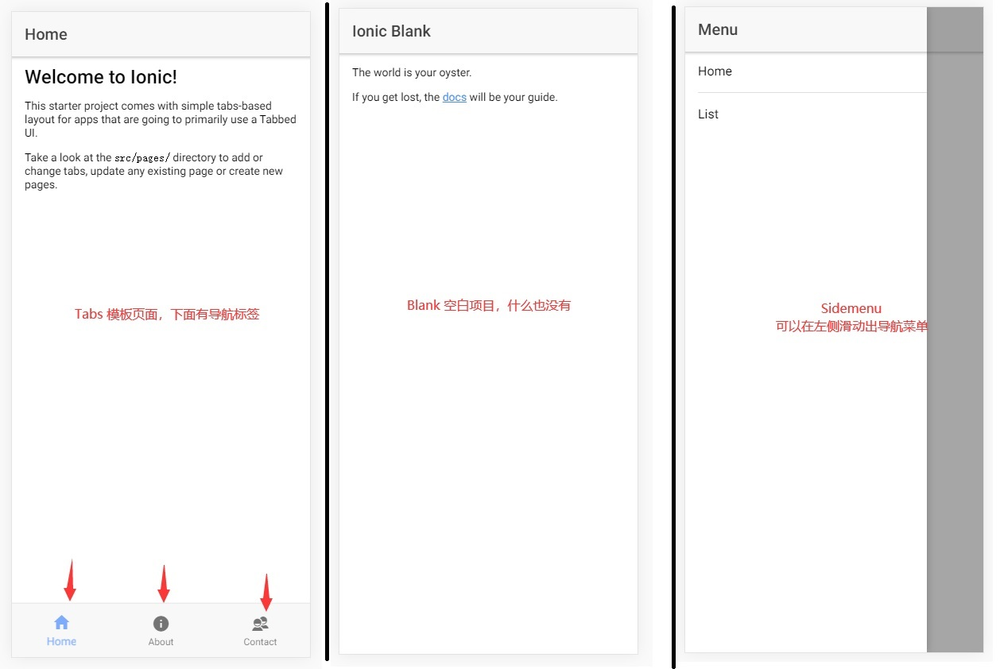

# Ionic3 学习笔记

Ionic 是基于 H5 的移动端开发框架，学习 Ionic 前最起码需要掌握 HTML5，CSS3，JavaScript，Angular

## Ionic3 初体验

### 环境安装

安装 ionic3 的前提环境需要安装 node.js，没有安装 node 环境的请现行安装，这里我安装的是 `v10.16.3` ：

~~~cmd
C:\WINDOWS\system32>node -v
v10.16.3
C:\WINDOWS\system32>npm -v
6.9.0
~~~

安装 ionic 依赖包 `ionic` ，`cordova`：

~~~cmd
# 你没有看错，安装ionic4是用来创建ionic3的项目的。
npm install -g ionic@4.6.0 cordova@8.0.0
~~~

如果安装途中出现了意外，请先删除干净后再进行安装

~~~
npm uninstall -g ionic cordova
~~~

稍等片刻就会安装结束，我们可以通过 -v 命令查看版本号，确认是否安装成功：

~~~cmd
C:\WINDOWS\system32>cordova -v
8.0.0

C:\WINDOWS\system32>ionic -v
   _             _
  (_) ___  _ __ (_) ___
  | |/ _ \| '_ \| |/ __|
  | | (_) | | | | | (__
  |_|\___/|_| |_|_|\___|  CLI 4.6.0
  ......................................省略一大堆
~~~

### 创建第一个程序

随便找个地方创建文件夹，，然后使用开发工具 ( 我这里使用 VScode ) 打开该目录作为 ionic3 的工作空间，ionic 创建项目的命令为 `ionic start`，在创建项目的时候需要手动设置几个参数，如下所示：

> 创建 ionic3 项目

~~~cmd
D:\_Zhe\VScode_Workspace\Ionic>ionic start

# 这里说我们安装的是Ionic4，是否使用新版的4创建项目，那肯定不能啊，我们学的是Ionic3，这里选 N
[INFO] You are about to create an Ionic 3 app. Would you like to try the release candidate for Ionic 4?
..........
? Try Ionic 4? (y/N) # N

# 取一个项目名称
? Project name: # demo1

# ionic预置了多种项目模板，前面的 > 代表选中项，可以通过 ↑ ↓ 更改选中项，这里选择 tabs 然后回车
? Starter template: # tabs
> tabs     | A starting project with a simple tabbed interface
  blank    | A blank starter project
  sidemenu | A starting project with a side menu with navigation in the content area
  super    | A starting project complete with pre-built pages, providers and best practices for Ionic development. 
  tutorial | A tutorial based project that goes along with the Ionic documentation
  aws      | AWS Mobile Hub Starter
  
## 项目创建过程取决于网速，时间可能会很久，多等等就好了 ##
  
# 这个关于安卓的选项我没搞过，直接选 N 就好了
? Install the free Ionic Appflow SDK and connect your app? (Y/n) # N
~~~

到这里项目就创建完成了，我们会发现工作空间中多了一个 demo1 的文件目录，这个就是我们的项目了，cd 进我们的项目中，输入命令 `ionic serve` 就可以启动程序，我们就可以在本地的 8100 端口看到项目了。

### 项目细节记录

> 项目创建时的细节

1、我们在创建项目的时候，输入 `ionic start` 后要手动填写两个配置，才可以创建成功，其实可以省去这两个步骤，我们可以直接将参数卸载命令上，例如 `ionic start demo tabs`

2、在创建项目的时候都会使用 tabs 模板创建，创建出来之后的模板底部有三个标签按钮，除开 tabs 模板之外，还有其他的创建模板

| 模板名称 | 模板内容描述                                                 |
| -------- | ------------------------------------------------------------ |
| blank    | 空白的项目                                                   |
| tabs     | 底部带有导航标签按钮                                         |
| sidemenu | 左侧可滑动的导航按钮                                         |
| super    | 一个简单的程序实例，带有欢迎页，登录注册等等功能，可供学习查看 |

三种页面展示

> 项目启动时的细节

启动项目的命令，首先是 cd 到项目目录下，然后输入 `ionic serve` 运行项目，我们可以再项目根目录下的 `package.json` 文件中自定义启动的命令：

~~~json
"scripts": {
    "start": "ionic-app-scripts serve --port 8008 --open",
    "clean": "ionic-app-scripts clean",
    "build": "ionic-app-scripts build",
    "lint": "ionic-app-scripts lint"
},
~~~

在 scripts 下的 start 后面追加 `--port 8008 --open`，表示项目在 8008 端口运行，且启动项目后自动打开浏览器访问，然后我们就可以使用 npm start 启动项目了。

## 学习 Page 页面

在 ionic 中负责显示的就是 page 页面，他们在项目目录下的 src/pages 目录中存放，每个文件夹都是一个 page 页面，由多个文件组成，根据 tabs 模板创建的项目，默认显示的就是 tabs 页面，tabs 页面默认将第一个选项选中，也就是 home 页面。

### 新建 Page 页面

基于 tabs 的项目默认有四个 page 页面，分别是 tabs，home，about，contact，接下来我们来创建一个自己的 page 页面，随便选择一个 ( 例如 home ) 复制，修改为 hello 页面，修改后的代码如下：

> 1、创建 ( 复制 ) page 页

~~~html
<!-- hello.html 修改 -->
<ion-header>
  <ion-navbar>
    <ion-title>标题-欢迎</ion-title>
  </ion-navbar>
</ion-header>

<ion-content padding>
    <h1>Hello World</h1>
    
这是我自己创建的一个组件

</ion-content>
~~~

~~~css
/* 这里修改css样式作用域 */
page-hello {

}
~~~

~~~javascript
/* hello.ts 修改 */
import { Component } from '@angular/core';
import { NavController } from 'ionic-angular';

@Component({
    // 这里填写刚刚的css作用域
    selector: 'page-hello',
    // 这里写关联的页面
    templateUrl: 'hello.html',
})

// 这里更改当前Page的名称，建议以Page结尾见名之意
export class HelloPage {
    constructor(public navCtrl: NavController) {}
}
~~~

> 2、page 页创建完成之后，还需要在项目中添加引用 -> app.module.ts

~~~javascript
/* app.module.ts */
import { HelloPage } from '../pages/hello/hello';

/* Page 页面需要在 declarations，entryComponents 添加引用才可以使用 */
@NgModule({
    declarations: [
        HelloPage,
        .....
    ],
    entryComponents: [
        HelloPage,
        .....
    ],
})
~~~

> 3、之后再 tabs 页中调用这个组件进行显示

~~~ts
import { Component } from '@angular/core';

import { AboutPage } from '../about/about';
import { ContactPage } from '../contact/contact';
import { HomePage } from '../home/home';
// 添加对 hello 的引用
import { HelloPage } from '../hello/hello';

@Component({
    templateUrl: 'tabs.html'
})

export class TabsPage {

    tab1Root = HomePage;
    tab2Root = AboutPage;
    tab3Root = ContactPage;
    // 声明变量最后在页面中使用
    tab4Root = HelloPage;
    
    constructor(public navCtrl: NavController) {}
    
}
~~~

~~~html
<ion-tabs>
    <!-- 新增的导航标签 -->
	<ion-tab [root]="tab4Root" tabTitle="欢迎" tabIcon="contacts"></ion-tab>
</ion-tabs>
~~~

总结一下，添加一个 page 要修改文件名，class 名，样式名等等，然后在 `app.module.ts` 中添加引用，最后在页面中使用的时候在引用一次就 OK 了。

### 新建页面和懒加载

> 快速创建 page 页面的方法

之前我们创建组件都是复制过去该来改去，现在我们来使用命令创建组件 `ionic g page java`，会发现在 pages  目录下多了一个 java 文件夹，查看目录中包含 module 文件，也就意味着使用命令创建组件默认是懒加载方式创建的，那么什么是懒加载呢？

当我们第一次进入应用，会加载 app.module 文件，该文件中引用的所有 page 都会被加载，但是当项目中的 page 页面数量很多的时候，一些页面我们根本用不上，这时我们需要使用 **懒加载** 来解决这种问题。

> 实现组件的懒加载

目前一个 page 页由三个文件组成，html 文件负责当前 page 页面布局，scss 文件负责当前 page 的样式 ( 不会影响到其他 page 页面 )，然后通过 ts 将文件汇总起来向外暴露 ( export ) 对象，当我们使用懒加载的时候，需要在额外添加一个 `module` 文件，以 tabs 中的 about 页为例

1、添加 `about.module.ts` 文件

~~~javascript
import { NgModule } from "@angular/core";
import { AboutPage } from "./about";
import { IonicPageModule } from "ionic-angular";

@NgModule({
    declarations: [
        AboutPage
    ],
    imports: [
        IonicPageModule.forChild(AboutPage)
    ]
})

export class AboutPageModule{ }
~~~

2、在 page 中添加懒加载注解 `@IonicPage()`

~~~javascript
import { Component } from '@angular/core';
import { NavController, IonicPage } from 'ionic-angular';

@IonicPage()
@Component({
    selector: 'page-about',
    templateUrl: 'about.html'
})

export class AboutPage {
    constructor(public navCtrl: NavController) { }
}
~~~

3、删除 `app.module.ts` 和 `tabs.ts` 中的引用，在 tabs 中直接使用

~~~javascript
import { Component } from '@angular/core';

// 引用不需要了 import { AboutPage } from '../about/about';
import { ContactPage } from '../contact/contact';
import { HomePage } from '../home/home';
// 添加对 hello 的引用
import { HelloPage } from '../hello/hello';

@Component({
    templateUrl: 'tabs.html'
})

export class TabsPage {

    tab1Root = HomePage;
	// 直接字符串就可以了
    tab2Root = "AboutPage";
    tab3Root = ContactPage;
    // 声明变量最后在页面中使用
    tab4Root = HelloPage;
    
    constructor(public navCtrl: NavController) {}
    
}
~~~

